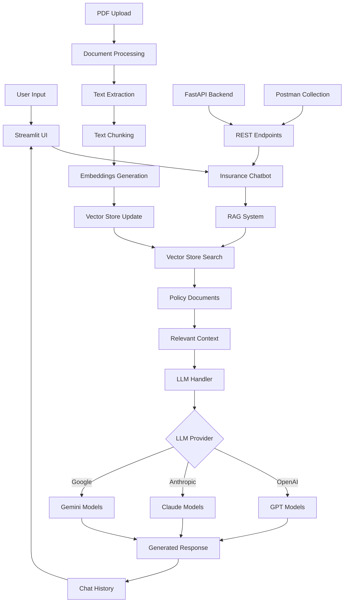

# VIA - Virtual Insurance Assistant

A comprehensive insurance chatbot application that provides instant answers about insurance policies using RAG (Retrieval-Augmented Generation) technology.

##  Key Features

- **RAG System**: Processes insurance policy documents and provides context-aware answers
- **Multiple LLM Support**: OpenAI GPT, Anthropic Claude, Google Gemini
- **Friendly UI**: Beautiful Streamlit interface with chat history
- **REST API**: Complete FastAPI backend for integration
- **Docker Support**: Easy deployment with Docker and Docker Compose
- **Postman Collection**: Ready-to-use API testing collection

## Project Structure

```
Insurance_chatbot-1/
├── 📁 docker/                    # Docker configuration files
│   ├── Dockerfile
│   ├── docker-compose.yml
│   └── docker_init.py
├── 📁 scripts/                   # Build and utility scripts
│   ├── build_and_run.bat        # Windows build script
│   └── build_and_run.sh         # Linux/Mac build script
├── 📁 config/                    # Configuration files
│   ├── env.example              
│   └── requirements.txt         
├── 📁 postman/                   # API testing files
│   ├── Insurance_Chatbot_API.postman_collection.json
│   └── POSTMAN_TESTING.md
├── 📁 policy_docs/               # Insurance policy PDF files
│   ├── car_insurance_policy.pdf
│   ├── car_policy.pdf
│   └── health_policy.pdf
├── 📁 models/                    # Vector store models
├── 📁 __pycache__/               # Python cache files
├── 📄 app.py                     # Main Streamlit application
├── 📄 api.py                     # FastAPI backend
├── 📄 chatbot.py                 # Chatbot core logic
├── 📄 rag_system.py              # RAG system implementation
├── 📄 llm_handlers.py            # LLM provider handlers
├── 📄 utils.py                   # Utility functions
├── 📄 create_vectorstore.py      # Vector store creation utility
├── 📄 RUNNING_INSTRUCTIONS.md    # Detailed setup guide
└── 📄 README.md                  
```

## Application Flow



## Quick Start

### Prerequisites
- Docker and Docker Compose
- Python 3.9+ (for local development)

### Running with Docker (Recommended)

1. **Set up environment:**
   ```bash
   # Copy environment template
   cp config/env.example config/.env
   
   # Edit config/.env with your API keys
   # OPENAI_API_KEY=your_openai_api_key_here
   # ANTHROPIC_API_KEY=your_anthropic_api_key_here
   # GOOGLE_API_KEY=your_google_api_key_here
   # DEFAULT_LLM_PROVIDER=openai
   ```

2. **Add policy documents:**
   - Place PDF files in `policy_docs/` folder
   - The system will automatically process them

3. **Build and run:**
   ```bash
   # Windows
   scripts/build_and_run.bat
   
   # Linux/Mac
   chmod +x scripts/build_and_run.sh
   ./scripts/build_and_run.sh
   ```

4. **Access the application:**
   - Streamlit UI: http://localhost:8501
   - FastAPI docs: http://localhost:8000/docs

### Running Locally

1. **Install dependencies:**
   ```bash
   pip install -r requirements.txt
   ```

2. **Set up environment:**
   ```bash
   cp config/env.example .env
   # Edit .env with your API keys
   ```

3. **Run the application:**
   ```bash
   streamlit run app.py
   ```

## Configuration

### Environment Variables
- `OPENAI_API_KEY`: OpenAI API key
- `ANTHROPIC_API_KEY`: Anthropic API key  
- `GOOGLE_API_KEY`: Google API key
- `DEFAULT_LLM_PROVIDER`: Default LLM provider (openai, anthropic, google) - defaults to openai

## Documentation

- [Running Instructions](RUNNING_INSTRUCTIONS.md) - Detailed setup and usage guide
- [API Testing](postman/POSTMAN_TESTING.md) - Postman collection for API testing


## Adding New Policy Documents
1. Place PDF files in `policy_docs/` folder
2. Restart the application
3. Documents will be automatically processed and added to the vector store

### Enjoy 💖