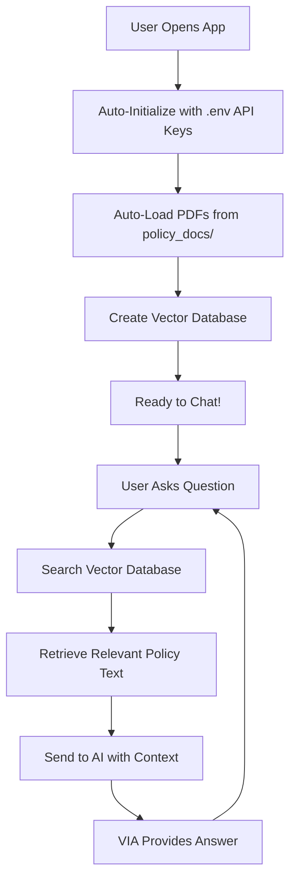

# VIA - Virtual Insurance Assistant

A comprehensive insurance policy chatbot that uses Retrieval-Augmented Generation (RAG) to answer questions based on insurance policy documents. The chatbot supports multiple LLM providers (OpenAI, Anthropic Claude, Google Gemini) and provides both a web UI and REST API.

##  Key Features

- **RAG System**: Processes insurance policy documents and provides context-aware answers
- **Multiple LLM Support**: OpenAI GPT, Anthropic Claude, Google Gemini
- **Friendly UI**: Beautiful Streamlit interface with chat history
- **REST API**: Complete FastAPI backend for integration
- **Docker Support**: Easy deployment with Docker and Docker Compose
- **Postman Collection**: Ready-to-use API testing collection

## Quick Start

📖 **For detailed installation and usage instructions, see [RUNNING_INSTRUCTIONS.md](RUNNING_INSTRUCTIONS.md)**

**TL;DR:**
1. Copy `env.example` to `.env` and add your API keys
2. Run `pip install -r requirements.txt`
3. Run `streamlit run app.py`
4. Open http://localhost:8501 and start chatting!

## Architecture

### Project Flow



## Project Structure

```
VIA-Insurance-Chatbot/
├── app.py                          # Streamlit web interface
├── api.py                          # FastAPI backend
├── chatbot.py                      
├── rag_system.py                   
├── llm_handlers.py                 
├── utils.py                        
├── requirements.txt                
├── docker-compose.yml              
├── Dockerfile                      
├── .env                           # Environment variables (need to create this. See running instructions)
├── env.example                    # Environment template
├── .gitignore                     
├── policy_docs/                   # Your insurance PDFs go here
│   └── car_insurance_policy.pdf   # Example policy document
├── models/                        # Vector store (auto-created)
│   └── faiss_index/               # FAISS vector database
├── README.md                      
├── RUNNING_INSTRUCTIONS.md        # Detailed setup guide
└── POSTMAN_TESTING.md             # API testing guide
```

## Testing

**For comprehensive API testing with Postman, see [POSTMAN_TESTING.md](POSTMAN_TESTING.md)**


## Troubleshooting

### Common Issues

1. **API Key Errors**: Ensure your API keys are correctly set in the `.env` file
2. **Document Processing**: Make sure PDF files are not corrupted and are readable
3. **Memory Issues**: For large documents, consider reducing chunk size

### Enjoy 💖
