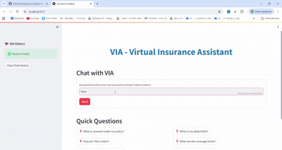
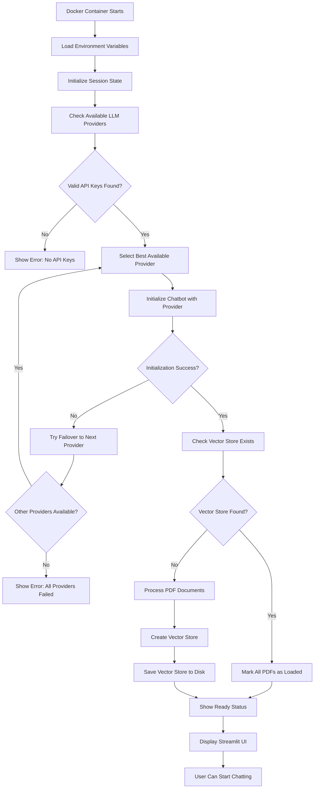
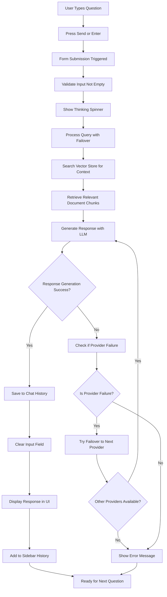

# VIA - Virtual Insurance Assistant

A comprehensive insurance chatbot application that provides instant answers about insurance policies using RAG (Retrieval-Augmented Generation) technology.

## 🎥 Demo

<p align="center">
  
</p>

*You can see more demos and pictures in the [demos](demos/) folder*

## ✨ Key Features & Capabilities

### **AI & Processing**
- **Multi-LLM Support**: OpenAI GPT, Anthropic Claude, Google Gemini
- **Automatic Failover**: Switches providers on API failures/quota limits
- **Smart Document Processing**: Skips already indexed PDFs
- **Vector Store Persistence**: FAISS-based semantic search
- **RAG System**: Retrieval-Augmented Generation for accurate responses

### **User Interface**
- **Interactive Chat**: Real-time conversation with VIA
- **Chat History**: Clickable conversation buttons in sidebar for easy return to old conversations
- **Quick Questions**: Pre-defined sample queries

### **Technical Features**
- **Docker Containerization**
- **Error Handling**: Graceful failure recovery
- **Build Scripts**

### **Data Management**
- **PDF Processing**: Policy document ingestion and chunking
- **Vector Indexing**: Semantic search capabilities
- **Session State**: Chat history and document tracking

### **Deployment**
- **Build Scripts**: Windows (.bat) and Linux/Mac (.sh)
- **API Testing**: Postman collection included
- **Documentation**: Comprehensive setup guides

## Project Structure

```
Insurance_chatbot-1/
├── 📱 Core Application
│   ├── app.py                    # Main Streamlit application (UI & logic)
│   ├── chatbot.py                # Chatbot class & conversation management
│   ├── rag_system.py             # RAG system for document processing & vector store
│   ├── llm_handlers.py           # LLM provider handlers (OpenAI, Anthropic, Google)
│   ├── api.py                    # FastAPI backend server
│   ├── utils.py                  # Utility functions & API key management
│   └── create_vectorstore.py     # Standalone vector store creation script
│
├── ⚙️ Configuration
│   └── config/
│       ├── env.example           # Environment variables template
│       └── requirements.txt      # Python dependencies (18 packages)
│
├── 🐳 Docker Setup
│   └── docker/
│       ├── Dockerfile            # Docker image configuration (Streamlit)
│       ├── Dockerfile.api        # Docker image configuration (API)
│       ├── docker-compose.yml    # Container orchestration (Streamlit app)
│       ├── docker-compose.api.yml # Container orchestration (API testing)
│       └── docker_init.py        # Docker initialization & vector store creation
│
├── 🚀 Build Scripts
│   └── scripts/
│       ├── build_and_run.sh      # Linux/Mac build & run script
│       ├── build_and_run.bat     # Windows build & run script
│       ├── start_api_docker.sh   # Linux/Mac API Docker script
│       ├── start_api_docker.bat  # Windows API Docker script
│       └── test_docker_api.py    # API testing script
│
├── 💾 Data & Models
│   ├── models/
│   │   └── faiss_index/          # FAISS vector store (persistent)
│   │       ├── index.faiss       # Main vector index file
│   │       └── index.pkl         # Vector metadata file
│   └── policy_docs/              # PDF policy documents
│       └── car_policy.pdf        # Sample insurance policy
│
├── 📚 Documentation
│   ├── README.md                 # Project overview & setup
│   └── RUNNING_INSTRUCTIONS.md   # Detailed setup & troubleshooting guide
│
├── 🎥 Demo & Media
│   └── demos/
│       ├── chatbot.png                    # Screenshot 1
│       ├── chatbot2.png                   # Screenshot 2
│       ├── demo1.mp4                      # Demo video
│       ├── demo2.mp4                      # Demo video
|       ├── demo2.GIF                      # Main demo GIF
│       └── clear_chat_history_demo.mp4    # Chat history demo
│
└── 🔌 API Testing
    └── postman/
        ├── Insurance_Chatbot_API.postman_collection.json  # Postman collection
        ├── POSTMAN_TESTING_GUIDE.md                       # Comprehensive API testing guide
        └── postman_images/                                # Postman testing screenshots
            ├── after_import.png
            ├── environment_setup.png
            ├── get_chat_history.png
            ├── get_policy_documents.png
            ├── load_policy_documents.png
            ├── openai_initialize_chatbot.png
            ├── send_message_coverage_limit.png
            ├── send_message_exclusions.png
            └── send_message_general_question.png
```

## 🔄 System Architecture

```mermaid
graph TB
    subgraph "Frontend Layer"
        UI[Streamlit App<br/>app.py]
        SIDEBAR[Sidebar<br/>• VIA History<br/>• Chat Buttons<br/>• Clear History]
        MAIN[Main Area<br/>• Chat Display<br/>• Input Form<br/>• Quick Questions]
    end

    subgraph "Application Layer"
        CHATBOT[InsuranceChatbot<br/>chatbot.py]
        RAG[InsuranceRAGSystem<br/>rag_system.py]
        LLM[LLM Handlers<br/>llm_handlers.py]
        API[FastAPI Backend<br/>api.py]
    end

    subgraph "AI Providers"
        OPENAI[OpenAI<br/>GPT-3.5/4]
        ANTHROPIC[Anthropic<br/>Claude 3]
        GOOGLE[Google<br/>Gemini Pro]
    end

    subgraph "Data Layer"
        VECTOR[(FAISS Vector Store<br/>models/faiss_index/)]
        PDFS[Policy Documents<br/>policy_docs/]
        ENV[Environment Config<br/>config/.env]
    end

    subgraph "Infrastructure"
        DOCKER[Docker Container<br/>insurance-rag-chatbot]
        COMPOSE[Docker Compose<br/>Multi-service orchestration]
    end

    UI --> SIDEBAR
    UI --> MAIN
    UI --> CHATBOT
    CHATBOT --> RAG
    CHATBOT --> LLM
    RAG --> VECTOR
    RAG --> PDFS
    LLM --> OPENAI
    LLM --> ANTHROPIC
    LLM --> GOOGLE
    API --> CHATBOT
    DOCKER --> UI
    COMPOSE --> DOCKER
    ENV --> LLM
```



## 🚀 Program Initialization Flow



## 💬 User Question Processing Flow



## Quick Start

### Prerequisites
- Docker
- Python 3.9+ (for local development)

### Running with Docker (Recommended)

1. **Set up environment:**
   ```bash
   # Copy environment template
   cp config/env.example config/.env
   
   # Edit config/.env with your API keys
   # OPENAI_API_KEY=your_openai_api_key_here
   # ANTHROPIC_API_KEY=your_anthropic_api_key_here
   # GOOGLE_API_KEY=your_google_api_key_here
   # DEFAULT_LLM_PROVIDER=openai
   ```

2. **Add policy documents:**
   - Place PDF files in `policy_docs/` folder
   - The system will automatically process them

3. **Build and run:**
   ```bash
   # Windows
   scripts/build_and_run.bat
   
   # Linux/Mac
   chmod +x scripts/build_and_run.sh
   ./scripts/build_and_run.sh
   ```

4. **Access the application:**
   - Streamlit UI: http://localhost:8501
   - FastAPI docs: http://localhost:8000/docs

### API Testing with Docker

1. **Start API with Docker:**
   ```bash
   # Windows
   scripts\start_api_docker.bat
   
   # Linux/Mac
   ./scripts/start_api_docker.sh
   ```

2. **Test the API:**
   ```bash
   python scripts/test_docker_api.py
   ```

3. **Import Postman Collection:**
   - Import `postman/Insurance_Chatbot_API.postman_collection.json`
   - Set up environment variables
   - Start testing endpoints

### Running Locally

1. **Install dependencies:**
   ```bash
   pip install -r requirements.txt
   ```

2. **Set up environment:**
   ```bash
   cp config/env.example .env
   # Edit .env with your API keys
   ```

3. **Run the application:**
   ```bash
   streamlit run app.py
   ```

## Configuration

### Environment Variables
- `OPENAI_API_KEY`: OpenAI API key
- `ANTHROPIC_API_KEY`: Anthropic API key  
- `GOOGLE_API_KEY`: Google API key
- `DEFAULT_LLM_PROVIDER`: Default LLM provider (openai, anthropic, google) - defaults to openai

## Documentation

- [Running Instructions](RUNNING_INSTRUCTIONS.md) - Detailed setup and usage guide
- [API Testing Guide](postman/POSTMAN_TESTING_GUIDE.md) - Comprehensive Postman testing guide


## Adding New Policy Documents
1. Place PDF files in `policy_docs/` folder
2. Restart the application
3. Documents will be automatically processed and added to the vector store

### Enjoy 💖


